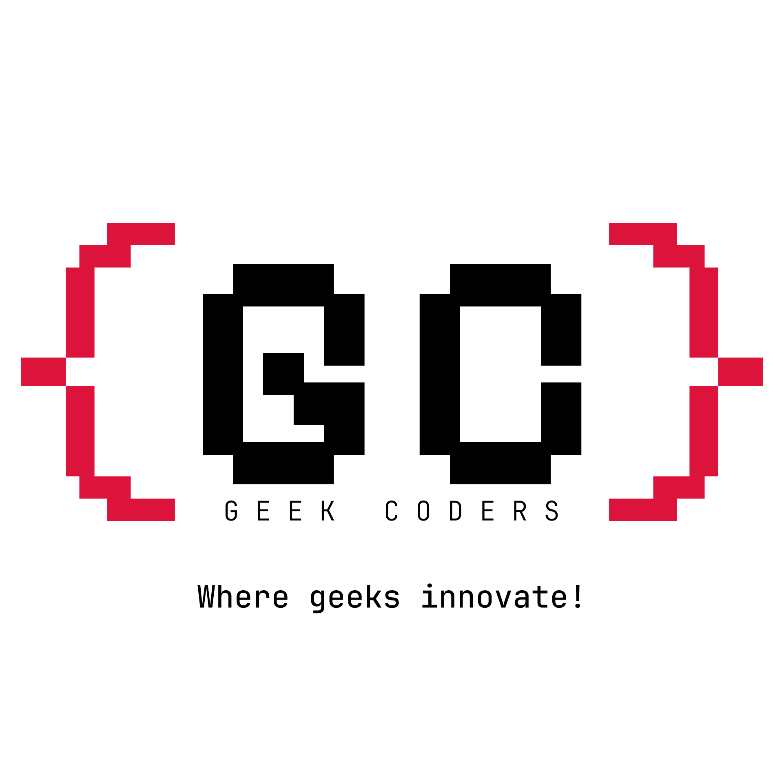

# GeekCoders Community Website



Welcome to the official repository of **GeekCoders** - a thriving tech community built on collaboration, life-long learning, and innovation. We conduct workshops, competitions, webinars, seminars, and more to empower developers worldwide.

---

## 🚀 About GeekCoders

GeekCoders is an open-source tech community dedicated to:
- Encouraging collaboration and knowledge sharing
- Hosting interactive workshops and webinars
- Organizing coding competitions and hackathons
- Providing mentorship and networking opportunities
- Fostering open-source contributions

This repository contains the **source code** for our community website, which serves as a hub for our activities and events.

---

## 🌟 Open Source Contribution

We are excited to announce that our **community website** is now **open source**! As part of our commitment to open-source development, this repository is open for contributions from developers worldwide.

### 🎯 Why Contribute?
- Gain experience with real-world open-source projects
- Improve your coding and debugging skills
- Collaborate with like-minded developers
- Earn recognition for your contributions
- Enhance your portfolio with meaningful contributions

---

## 🎉 GitRecQuest Open Source Event

Our community website is participating in **GitRecQuest v1.0.0**, an **inter-college open-source contribution contest** organized by **Intellexa and Google Developer Groups (GDG) REC**.  

🌐 Website: [www.gitrecquest.com](https://www.gitrecquest.com)  

### 📅 Event Timeline
- **Jan 1 - Jan 20**: Website goes live & volunteers are finalized
- **Jan 20 - Feb 15**: Promotional activities & contributor registration
- **Feb 15 - Mar 15**: Open-source contributions phase
- **Mar 15 - Mar 30**: Winner announcements & prize distribution

### 🏆 Prizes & Recognition
- **Top 10 contributors** will receive exciting rewards
- **Best Woman Contributor** will be recognized
- Internship offers & cash prizes (T&C apply)

---

## 🛠️ How to Contribute

1. **Fork the Repository**
2. **Clone Your Fork**
   ```sh
   git clone https://github.com/your-username/geekcoders-website.git
   cd geekcoders-website
   ```
3. **Create a New Branch**
   ```sh
   git checkout -b feature-branch
   ```
4. **Make Your Changes & Commit**
   ```sh
   git add .
   git commit -m "Your meaningful commit message"
   ```
5. **Push to Your Fork & Create a Pull Request**
   ```sh
   git push origin feature-branch
   ```
6. **Wait for Review & Approval**

---

## 💡 Contribution Guidelines

- Follow best practices for **code structure** and **documentation**
- Ensure **proper commit messages** and **pull request descriptions**
- Respect community standards and **code of conduct**
- Engage in **constructive discussions** on issues and PRs

---

## 📢 Get Involved

💬 **Join the Discussion:** [GeekCoders Community](https://chat.whatsapp.com/JhJM8xtkoGXHzGW5vXFrYL)

🐛 **Report Issues:** [GitHub Issues](https://github.com/geekcoders-community/GeekCoders.Community/issues)

---

## 📞 Contact Us

📧 Email: [francisamal030@gmail.com](mailto:francisamal030@gmail.com)  
🌐 Website: [geekcoders-community.pages.dev](https://geekcoders-community.pages.dev/)  
📱 Badri: +91 6380 861 730  
📱 Amal: +91 9363 032 004    

---

## 📜 License

This project is licensed under the **MIT License** - see the [LICENSE](LICENSE) file for details.

Happy Coding! 🚀
